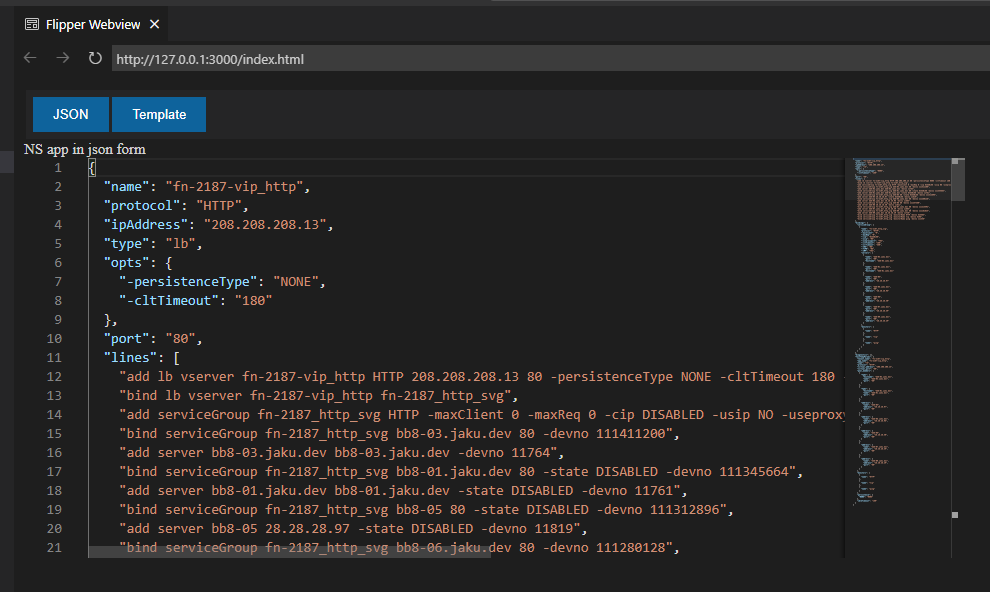

# flipper_webview

Exploring a better HTML page for Flipper.

I envision a single html page with a couple of nav buttons to toggle between the different data views.  Original NS lines, ns app as json, and the fast template html, then the fast template output

**Here is an initial example**

## License

This project is licensed under the Apache License 2.0 - see the [LICENSE](LICENSE) file for details.
